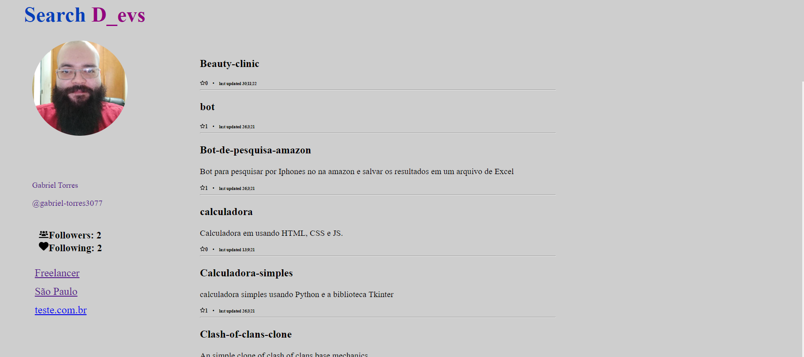

# Projeto Angular DevSearch


Projeto feito com intuito de buscar um usuário no github e exibir seus dados.



# Requirements
- Angular Versão 14.1.3


# Instalation
- Rode o comando 'npm install' para instalar toodas as competências necessárias

>npm install  


- Utilize o comando 'ng server' para rodar o projeto localmente
```yml
> ng s


✔ Browser application bundle generation complete.

Initial Chunk Files   | Names         |  Raw Size
vendor.js             | vendor        |   3.38 MB | 
main.js               | main          |  47.94 kB |
runtime.js            | runtime       |   6.51 kB |

                      | Initial Total |   3.95 MB

Build at: 2022-12-09T09:56:51.892Z - Hash: 7930ca72a4c7e685 - Time: 13187ms

** Angular Live Development Server is listening on localhost:4200, open your browser on http://localhost:4200/ **


√ Compiled successfully.

```